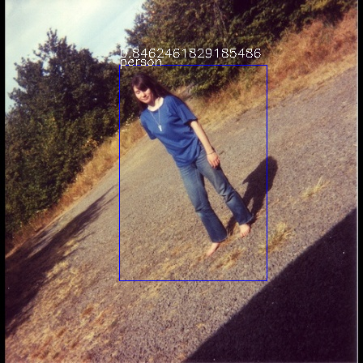
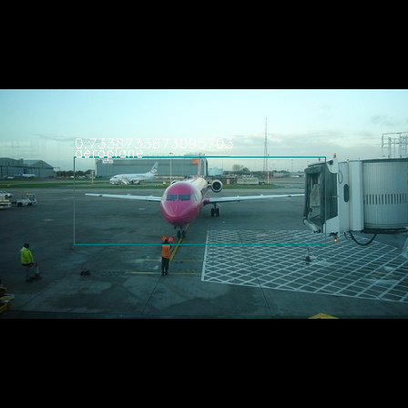
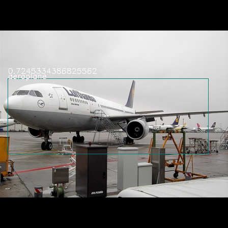

# README

implementation of YOLOv1

from [BLOG](https://blog.csdn.net/weixin_41424926/article/details/105383064)

**Required:**

* pytorch 1.1.0
* torchvision
* numpy > 1.16.2
* opencv 3.4.1
* VOC2012 Dataset

**What can this repo do now**

* train with VOC2012 Dataset
* inference(test images)

**Result**

**TODO:**

* add mAP metric